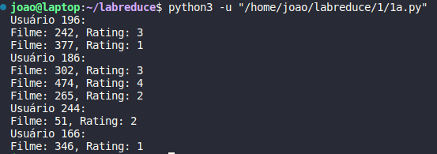

# Lab MapReduce

## I) Identificação
| Aluno(a)              | Matricula |
| --------------------- | --------- |
| João Gabriel de Matos | 180042238 |
| Maria Eduarda Abritta | 202016495 |

## Introdução

O projeto proposto envolve a implementação de soluções em Python relacionadas a processamento de dados e algoritmos, com a possibilidade de adaptação para um ambiente Hadoop. São apresentados dois problemas distintos: 
1. Análise de Dados de Filmes e Ratings: 
O objetivo é criar um programa em Python para ler um arquivo de dados tabulares e listar os filmes e suas respectivas classificações (ratings) para cada usuário (user_id). O código deve destacar a estrutura utilizada para resolver esse problema. 
Em seguida, é proposta uma versão do problema utilizando as funções Map e Reduce em Python. 
Por fim, deve-se promover as alterações necessárias para que o código possa ser executado em ambiente Hadoop e documentar essas modificações em um arquivo README. 
1. Algoritmo PageRank para Rankeamento de Páginas na Web: 
Este problema envolve a pesquisa e implementação do algoritmo PageRank, amplamente usado para o ranqueamento de páginas na web. Primeiro, é necessário elaborar uma solução Python tradicional, com destaque para as estruturas utilizadas. 
Em seguida, propõe-se uma versão do problema que utiliza as funções Map e Reduce do algoritmo PageRank ou uma solução adaptada da literatura, devidamente referenciada. 
Por fim, deve-se gerar uma versão MapReduce do código Python e torná-lo funcional no ambiente Hadoop. Todas as modificações necessárias para viabilizar o funcionamento do algoritmo no Hadoop devem ser documentadas. 
Esses problemas oferecem a oportunidade de explorar técnicas de processamento de dados, algoritmos e adaptabilidade para ambientes distribuídos, como o Hadoop, que são habilidades valiosas em ciência de dados e engenharia de software.

## Questões

### 1A)  Elaboração de um programa em Python para listar filmes e suas avaliações por usuário.

Neste código, utilizamos um dicionário onde a chave é o ID do usuário e o valor é uma lista de tuplas contendo o filme assistido e a avaliação. Essa estrutura nos permite agrupar os filmes e suas avaliações por usuário.

```python
# Importação de bibliotecas necessárias
import pandas as pd

# Leitura do arquivo com informações de usuários e filmes
data = pd.read_csv('dados.csv')

# Estrutura de dados para armazenar filmes e suas avaliações por usuário
user_ratings = {}

# Iteração pelos registros do arquivo
for _, row in data.iterrows():
    user_id = row['user_id']
    movie = row['movie']
    rating = row['rating']
    
    # Verificar se o usuário já existe no dicionário
    if user_id in user_ratings:
        user_ratings[user_id].append((movie, rating))
    else:
        user_ratings[user_id] = [(movie, rating)]

# Exibição dos filmes e suas avaliações por usuário
for user_id, ratings in user_ratings.items():
    print(f"Usuário {user_id}:")
    for movie, rating in ratings:
        print(f"Filme: {movie}, Rating: {rating}")

```


### 1B) Versão com funções Map e Reduce em Python:

```python
from collections import defaultdict
from functools import reduce

# Leitura do arquivo com informações de usuários e filmes
data = pd.read_csv('dados.csv')

# Função Map: Mapear os dados para o formato (user_id, [(movie, rating)])
def mapper(row):
    user_id = row['user_id']
    movie = row['movie_id']
    rating = row['rating']
    return user_id, [(movie, rating)]

# Função Reduce: Agrupar os filmes e suas avaliações por usuário
def reducer(user_id, ratings_list):
    return user_id, reduce(lambda x, y: x + y, ratings_list)

# Mapear os dados
mapped_data = data.apply(mapper, axis=1)

# Agrupar os dados usando Reduce
user_ratings = defaultdict(list)
for user_id, ratings_list in mapped_data:
    user_ratings[user_id].append(ratings_list)

# Exibição dos filmes e suas avaliações por usuário
for user_id, ratings in user_ratings.items():
    print(f"Usuário {user_id}:")
    for movie, rating in ratings:
        print(f"Filme: {movie}, Rating: {rating}")

```

### 1C)
```python
from mrjob.job import MRJob

class MovieCount(MRJob):
    def mapper(self, _, line):
        # Dividir a linha CSV em campos
        user_id, movie = line.split(',')
        
        # Emitir o user_id como chave e 1 como valor
        yield user_id, 1

    def reducer(self, user_id, counts):
        # Somar o número de filmes assistidos por usuário
        total_movies = sum(counts)
        
        # Emitir o user_id e o total de filmes assistidos
        yield user_id, total_movies

if __name__ == '__main__':
    MovieCount.run()
```

* O mapeamento divide cada linha do arquivo CSV em campos (user_id e movie) e emite o user_id como chave e 1 como valor para cada filme assistido por um usuário.
* O reducionamento soma o número de filmes assistidos para cada usuário e emite o user_id juntamente com o total de filmes assistidos.


Para executar este código no Hadoop, siga os passos gerais mencionados anteriormente:

1. Empacote o código e suas dependências em um arquivo JAR ou ZIP.
2. Configure um arquivo de configuração MapReduce (geralmente em formato XML) especificando as entradas, saídas e o fluxo do trabalho.
3. Envie o arquivo de entrada (por exemplo, 'input.csv') para o HDFS.
4. Use o comando hadoop jar para executar o trabalho MapReduce, passando o arquivo JAR ou ZIP, o arquivo de configuração e as entradas/saídas no HDFS.


### 2A) Solução Python tradicional

```python
# Implementação do algoritmo PageRank em Python
def pagerank(graph, damping_factor=0.85, max_iterations=100, tolerance=1e-6):
    num_pages = len(graph)
    initial_value = 1.0 / num_pages
    ranks = [initial_value] * num_pages

    for _ in range(max_iterations):
        new_ranks = [0] * num_pages
        for i in range(num_pages):
            for j in range(num_pages):
                if graph[j][i]:
                    new_ranks[i] += ranks[j] / sum(graph[j])
        
        # Aplicar fator de amortecimento
        new_ranks = [(1 - damping_factor) / num_pages + damping_factor * rank for rank in new_ranks]

        # Verificar a convergência
        if sum(abs(new_ranks[i] - ranks[i]) for i in range(num_pages)) < tolerance:
            return new_ranks

        ranks = new_ranks

    return ranks

# Um exemplo de uso

graph = [
    [0, 1, 1],
    [1, 0, 0],
    [0, 1, 0]
]
result = pagerank(graph)
print("PageRank:", result)
```
### 2B)  Map e Reduce em python 

```python
from mrjob.job import MRJob

class PageRank(MRJob):
    def configure_args(self):
        super(PageRank, self).configure_args()
        self.add_passthru_arg('--damping-factor', type=float, default=0.85)
        self.add_passthru_arg('--num-pages', type=int, required=True)

    def mapper(self, _, line):
        # Parse a line of input
        parts = line.split('\t')
        page = parts[0]
        links = parts[1].split(',')

        # Distribute the PageRank equally among linked pages
        rank = float(parts[2]) / len(links)

        # Emit the contribution to each linked page
        for link in links:
            yield link, rank

        # Emit the page itself with its links for the next iteration
        yield page, links

    def reducer(self, page, values):
        new_rank = 0.0
        links = []

        for value in values:
            if isinstance(value, list):
                links = value
            else:
                new_rank += value

        damping_factor = self.options.damping_factor
        num_pages = self.options.num_pages

        # Calculate the new PageRank using the damping factor
        new_rank = (1 - damping_factor) / num_pages + damping_factor * new_rank

        # Emit the updated PageRank for the page
        yield page, new_rank

if __name__ == '__main__':
    PageRank.run()

```
Rode o codigo acima com o comando abaixo:

`python page_rank_mrjob.py input.txt --num-pages=<NUM_PAGES> --output-dir=output`

OBS: Substitua <NUM_PAGES> pelo número total de páginas no seu grafo e input.txt pelo arquivo de entrada contendo as informações do grafo no formato adequado. Certifique-se de que seus dados de entrada estejam formatados corretamente, seguindo o padrão de página, lista de links e PageRank inicial.

### 2C)

Para adaptar o código do algoritmo PageRank com funções Map e Reduce (2b) para executar no ambiente Hadoop (2c), é necessário fazer algumas alterações para atender aos requisitos do Hadoop e do MapReduce. Alterações necessárias e fornecer comentários explicativos estão detacados abaixo:

```python
from mrjob.job import MRJob

class PageRank(MRJob):
    def configure_args(self):
        super(PageRank, self).configure_args()
        self.add_passthru_arg('--damping-factor', type=float, default=0.85)
        self.add_passthru_arg('--num-pages', type=int, required=True)

    def mapper(self, _, line):
        parts = line.split('\t')
        page = parts[0]
        links = parts[1].split(',')

        # Emitir a página original com sua lista de links
        yield page, ('links', links)

        # Distribuir a importância do PageRank igualmente entre os links
        rank = float(parts[2]) / len(links)
        for link in links:
            yield link, ('rank', rank)

    def reducer(self, page, values):
        new_rank = 0.0
        links = []

        for value_type, data in values:
            if value_type == 'links':
                links = data
            elif value_type == 'rank':
                new_rank += data

        damping_factor = self.options.damping_factor
        num_pages = self.options.num_pages

        # Calcular o novo PageRank com o fator de amortecimento
        new_rank = (1 - damping_factor) / num_pages + damping_factor * new_rank

        # Emitir o novo PageRank para a página
        yield page, new_rank

if __name__ == '__main__':
    PageRank.run()
```

1. Mapeamento dos Dados de Entrada:

   * Os dados de entrada são lidos linha por linha, onde cada linha representa uma página da web com sua lista de links e PageRank.
As páginas originais são emitidas com a tag 'links', indicando que contêm informações sobre os links para distribuição de PageRank.
A importância do PageRank é distribuída igualmente entre os links e é emitida com a tag 'rank'.

2. Redução dos Dados:

   *   No estágio de redução, as informações são agrupadas por chave (página) e processadas em conjunto.
O PageRank é calculado para cada página, considerando as contribuições de todos os links.
O novo PageRank é emitido para a página correspondente.

3. Argumentos da Linha de Comando:

   * Foram adicionados argumentos da linha de comando para especificar o fator de amortecimento (--damping-factor) e o número total de páginas (--num-pages). Esses valores são passados durante a execução do trabalho Hadoop.
  
4. Execução do Trabalho Hadoop:

   * O script page_rank_mrjob.py é executado como um trabalho MapReduce do MRJob no Hadoop. Certifique-se de que o MRJob esteja configurado corretamente no ambiente Hadoop.